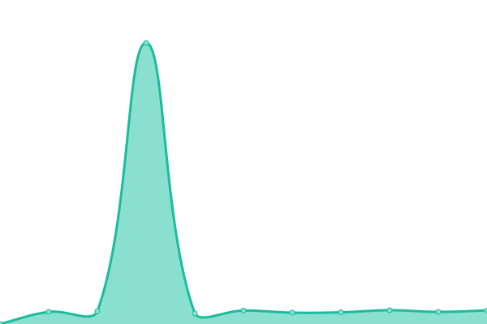

# [📈 Live Status](https://shelwong.github.io/benqservers): <!--live status--> **🟩 All systems operational**

This repository contains the open-source uptime monitor and status page for [shelwong](https://shelwong.github.io/benqservers), powered by [Upptime](https://github.com/upptime/upptime).

With [Upptime](https://upptime.js.org), you can get your own unlimited and free uptime monitor and status page, powered entirely by a GitHub repository. We use [Issues](https://github.com/shelwong/benqservers/issues) as incident reports, [Actions](https://github.com/shelwong/benqservers/actions) as uptime monitors, and [Pages](https://shelwong.github.io/benqservers) for the status page.

<!--start: status pages-->
<!-- This summary is generated by Upptime (https://github.com/upptime/upptime) -->
<!-- Do not edit this manually, your changes will be overwritten -->
<!-- prettier-ignore -->
| URL | Status | History | Response Time | Uptime |
| --- | ------ | ------- | ------------- | ------ |
|  [BenQ AMS](https://ams.benq.com/#/) | 🟩 Up | [ben-q-ams.yml](https://github.com/shelwong/benqservers/commits/HEAD/history/ben-q-ams.yml) | 

 496ms
     
 | 

<a href="https://shelwong.github.io/benqservers/history/ben-q-ams">100.00%</a>
    

|  [BenQ IAM](https://iam.benq.com/) | 🟩 Up | [ben-q-iam.yml](https://github.com/shelwong/benqservers/commits/HEAD/history/ben-q-iam.yml) | 

 692ms
     
 | 

<a href="https://shelwong.github.io/benqservers/history/ben-q-iam">100.00%</a>
    

|  [BenQ DMS](https://dms.benq.com/#/) | 🟩 Up | [ben-q-dms.yml](https://github.com/shelwong/benqservers/commits/HEAD/history/ben-q-dms.yml) | 

 476ms
     
 | 

<a href="https://shelwong.github.io/benqservers/history/ben-q-dms">100.00%</a>
    

|  [BenQ X-Sign Broadcast](https://x-signbroadcast.benq.com/) | 🟩 Up | [ben-q-x-sign-broadcast.yml](https://github.com/shelwong/benqservers/commits/HEAD/history/ben-q-x-sign-broadcast.yml) | 

 636ms
     
 | 

<a href="https://shelwong.github.io/benqservers/history/ben-q-x-sign-broadcast">100.00%</a>
    

|  [BenQ Service Portal](https://service-portal.benq.com/login) | 🟩 Up | [ben-q-service-portal.yml](https://github.com/shelwong/benqservers/commits/HEAD/history/ben-q-service-portal.yml) | 

 667ms
     
 | 

<a href="https://shelwong.github.io/benqservers/history/ben-q-service-portal">100.00%</a>
    

|  [SheldonTest](https://shelwong.github.io/MyWebsite/) | 🟩 Up | [sheldon-test.yml](https://github.com/shelwong/benqservers/commits/HEAD/history/sheldon-test.yml) | 

 91ms
     
 | 

<a href="https://shelwong.github.io/benqservers/history/sheldon-test">66.00%</a>
    

<!--end: status pages-->

[**Visit our status website →**](https://shelwong.github.io/benqservers)

## 📄 License

- Powered by: [Upptime](https://github.com/upptime/upptime)
- Code: [MIT](./LICENSE) © [shelwong](https://shelwong.github.io/benqservers)
- Data in the `./history` directory: [Open Database License](https://opendatacommons.org/licenses/odbl/1-0/)
